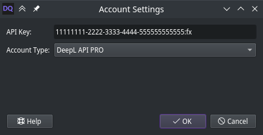

# API help

This tool is a front-end for the DeepL API, the world's best AI translator.
That necessitates access to the API using an API key.
You can sign up for a free or paid API account at [DeepL.com/pro-api](https://www.deepl.com/pro-api).

Once you have an account, visit your [account page](https://www.deepl.com/account/summary) to get your API key.

*Note: A free API key ends in `:fx`, while a pro key does not.*

Copy the API key and open the account settings in DeepQt.
Paste the key into the text field meant for it.

If you have a free account or set a limit on your pro account, translation may fail once you exceed your monthly quota.
Anything translated up until that happens will still be saved to the output file.
You can see your current usage level in DeepQt.